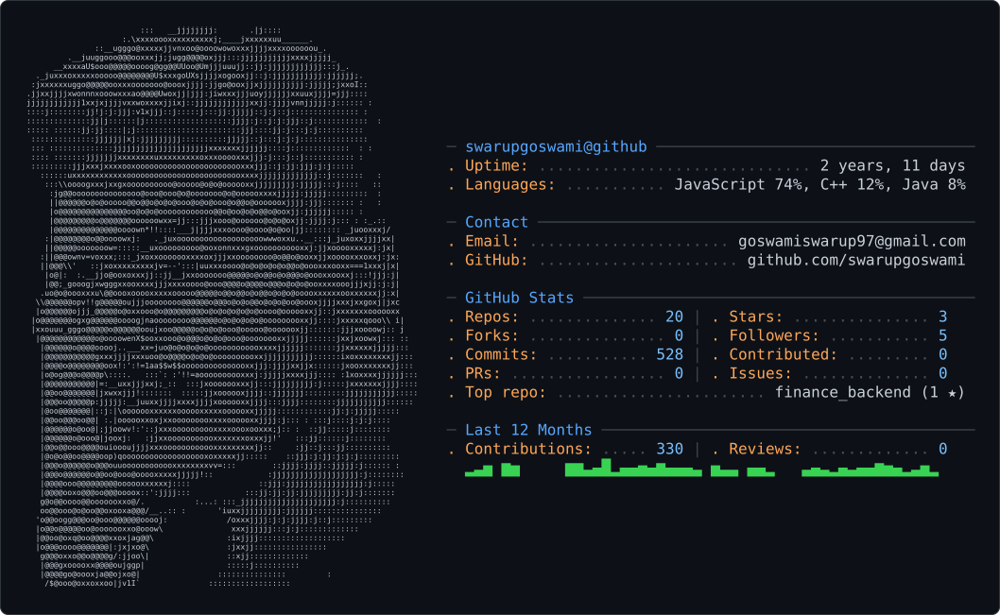

<picture>
  <source media="(prefers-color-scheme: dark)" srcset="dark_mode.svg" />
  <source media="(prefers-color-scheme: light)" srcset="light_mode.svg" />
  
</picture>

<h1 align="center">Hi 👋, I'm swarup goswami</h1>
<h3 align="center">A passionate full-stack developer from India</h3>

## 🌐 Socials:
   

# 💻 Tech Stack:
               

<!-- Proudly created with GPRM ( https://gprm.itsvg.in ) -->
